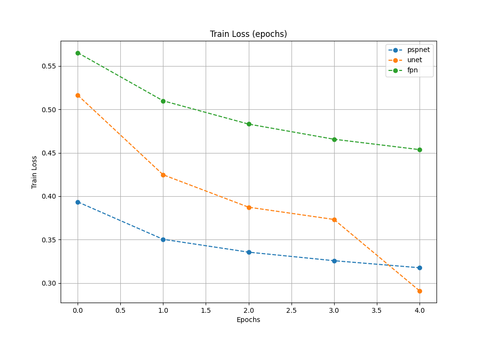
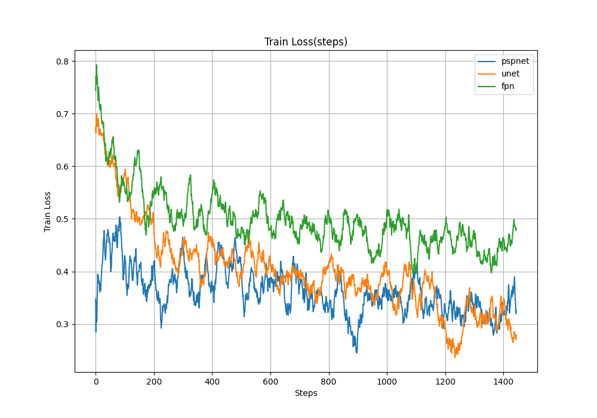
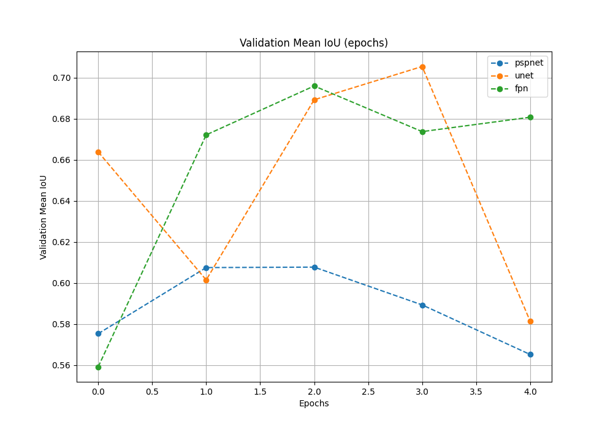
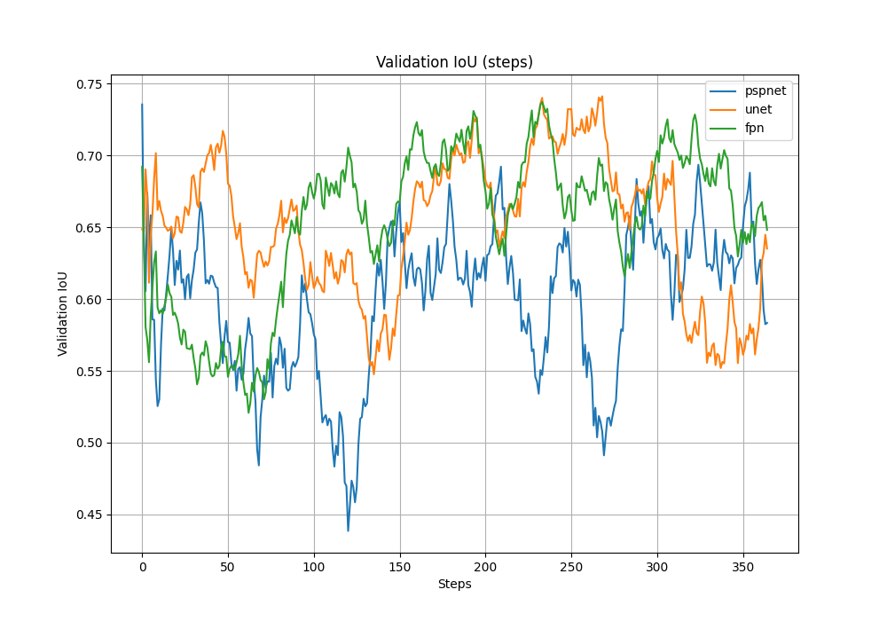
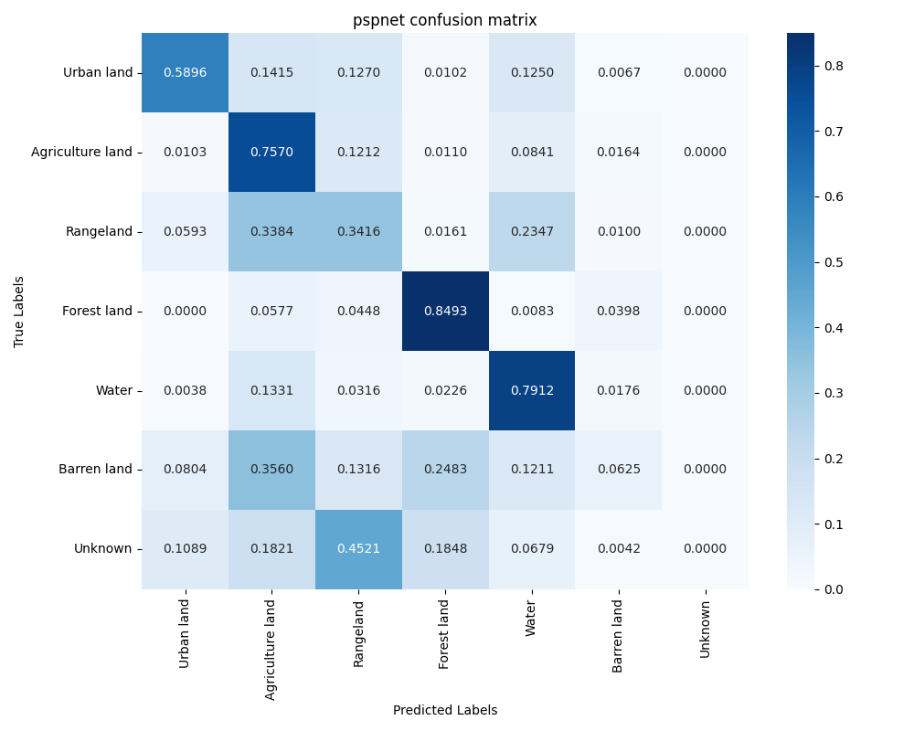
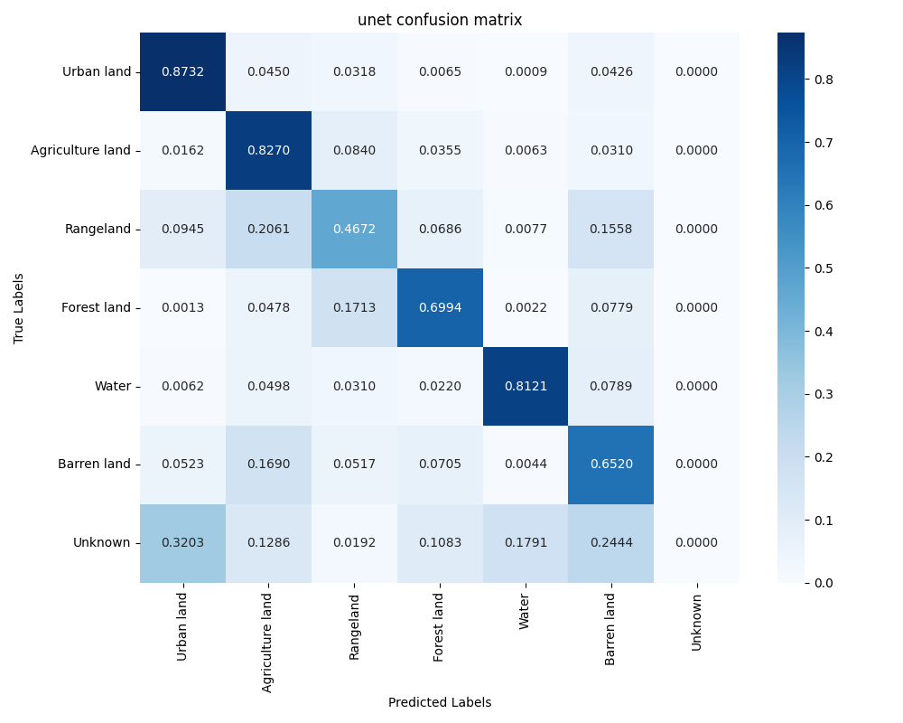
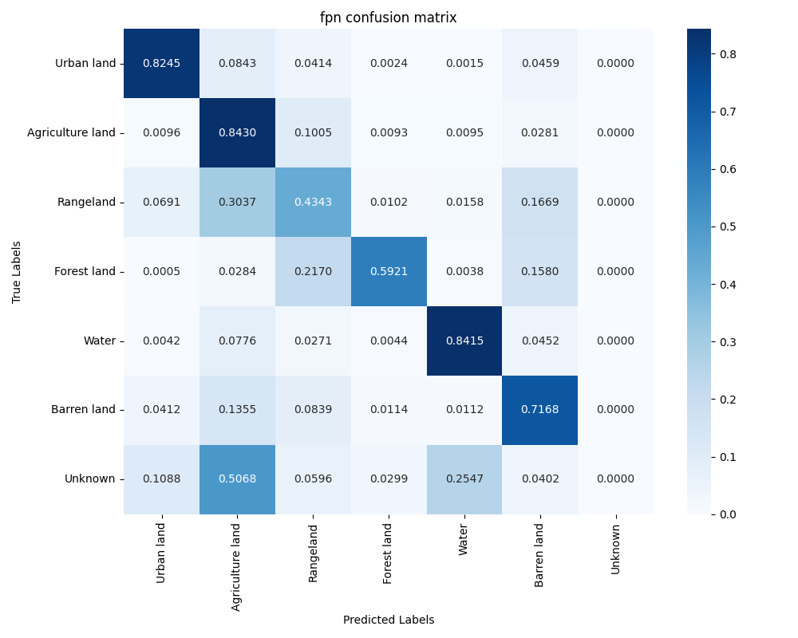

# Сравнение моделей семантической сегментации на DeepGlobe Land Cover Classification датасете

## Обзор

Этот проект посвящен сравнению различных моделей семантической сегментации (PSPNet, U-Net, FPN) на датасете DeepGlobe Land Cover Classification. Цель проекта — исследовать эффективность этих архитектур для задачи классификации типов земельного покрова по спутниковым снимкам. Репозиторий содержит код для подготовки данных, обучения моделей, их оценки и визуализации результатов.

## Структура проекта

```
.
├── .git/
├── .gitignore
├── .python-version
├── dataset/
│   ├── test/
│   ├── train/
│   └── valid/
├── notebooks/
│   ├── evaluate.ipynb
│   ├── training.ipynb
│   └── visualization.ipynb
├── pyproject.toml
├── README.md
├── results/
│   ├── collected/
│   └── ...
├── src/
│   ├── checkpoints/
│   ├── dataset.py
│   ├── diceloss.py
│   ├── evaluate.py
│   ├── main.py
│   ├── utils.py
│   └── visualization.py
└── uv.lock
```

## Содержание

* [Обзор](#обзор)
* [Структура проекта](#структура-проекта)
* [Датасет](#датасет)
* [Модели](#модели)
* [Использование](#использование)
    * [Установка](#установка)
    * [Обучение](#обучение)
    * [Оценка результатов](#оценка-результатов)
* [Результаты](#результаты)
* [Выводы](#вывод)

## Датасет

### Описание

В данном проекте используется датасет [DeepGlobe Land Cover Classification](https://www.kaggle.com/datasets/balraj98/deepglobe-land-cover-classification-dataset). Датасет содержит спутниковые снимки и соответствующие им маски для семантической сегментации.

### Классы:

| класс                       | цвет      | метка |
|:----------------------------|:---------:|:-----:|
| Город/Поселение             | бирюзовый | 0     |
| Сельскохозяйственные угодья | жёлтый    | 1     |
| Пастбище                    | пурпурный | 2     |
| Лес                         | зелёный   | 3     |
| Вода                        | синий     | 4     |
| Пустыня                     | белый     | 5     |
| Неизвестно                  | чёрный    | 6     |

### Примеры:

<div style="display:flex; align-items:center;">
    
    
</div>

<div style="display:flex; align-items:center;">
    
    
</div>

<div style="display:flex; align-items:center;">
    
    
</div>

Данные для обучения, валидации и тестирования находятся в директории `dataset/train`.

## Модели

В проекте реализованы и сравниваются следующие модели семантической сегментации:

* PSPNet (Pyramid Scene Parsing Network)
* U-Net
* FPN (Feature Pyramid Network)

Исходный код моделей и скрипты для обучения и оценки находятся в директории `src/`.

## Использование

### Установка

1. Клонируйте репозиторий:

```bash
git clone https://github.com/Kiri4s/segmentation-models-comparison.git
cd segmentation-models-comparison
```

2. Скачайте датасет [DeepGlobe Land Cover Classification](https://www.kaggle.com/datasets/balraj98/deepglobe-land-cover-classification-dataset) и расположите его в корневой директории проекта следующим образом:

```
.
└── dataset/
    └── train/
        ├── 119_mask.png
        ├── 119_sat.jpg
        ├── ...
        ├── 998002_mask.png
        └── 998002_sat.jpg
```

3. Установите [uv](https://docs.astral.sh/uv/) (для macOS и Linux):

```bash
curl -LsSf https://astral.sh/uv/install.sh | sh
```

4. Установите зависимости проекта из `pyproject.toml`:

```bash
uv sync
```

### Обучение

Для обучения моделей используется скрипт `src/main.py`. Параметры обучения можно изменить в классе `StandartConfig` в `src/main.py`.

Пример запуска обучения для модели U-Net:

```bash
cd src && uv run main.py --model_name='unet'
```

Для возобновления обучения с контрольной точки:

```bash
cd src && uv run main.py --model_name='unet' --load_from_checkpoint="path2checkpoint"
```

Обученные модели и история обучения сохраняются в директории `src/checkpoints/`.

### Оценка результатов

Для оценки результатов используется скрипт `src/evaluate.py`.

```bash
cd src && uv run evaluate.py
```

## Результаты

Результаты экспериментов, включая графики обучения и матрицы ошибок, сохраняются в директории `results/`.

### Визуальное сравнение

**Для каждой картинки последовательно сверху вниз: pspnet, unet, fpn**

<div style="display:flex; gap:8px; align-items:center;">
    
</div>
</br>
<div style="display:flex; gap:8px; align-items:center;">
    
</div>
</br>
<div style="display:flex; gap:8px; align-items:center;">
    
</div>

### Loss

<div style="display:flex; gap:8px; align-items:center;">
    
    
</div>

### IoU

<div style="display:flex; gap:8px; align-items:center;">
    
    
</div>

### Confusion matrix

<div style="display:flex; gap:8px; align-items:center;">
    
    
    
</div>

### Сравнение моделей по среднему IoU на тестовой выборке

| # | model  | loss      | mean_iou  |
|:-:|:------:|:---------:|:---------:|
| 0 | pspnet |  0.410559 |  0.317334 |
| 1 |   unet |  0.280340 |  0.474416 |
| 2 |    fpn |  0.441761 |  0.478314 |

## Вывод

Архитектуры **FPN** и **U-Net** показали себя наиболее эффективными для задачи семантической сегментации на датасете DeepGlobe Land Cover. Обе модели достигли схожих и высоких относительно **PSPnet** показателей по метрике `mean_iou`, при этом FPN (`0.478`) незначительно превзошла U-Net (`0.474`).
